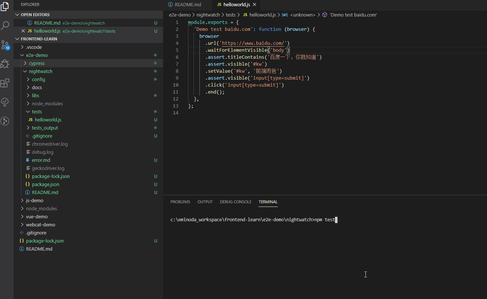

# Nightwatch

## 环境安装

### 模块安装

```shell
# 安装 nightwatch 模块
npm i nightwatch -D

# 安装驱动
# 火狐
npm i geckodriver -D
# 谷歌
npm i chromedriver -D
```

### 驱动手动安装

如果驱动安装有“限制问题”，可以参考如下手动安装方式：

1. 修改 npm 配置，更改下载路径

   ```shell
   npm install chromedriver --chromedriver_cdnurl=https://npm.taobao.org/mirrors/chromedriver
   ```

2. 设置系统环境变量（Windows）

   ```shell
   set CHROMEDRIVER_CDNURL=https://npm.taobao.org/mirrors/chromedriver npm install chromedriver
   ```

3. 直接使用本地驱动压缩包

   先去[淘宝镜像](https://npm.taobao.org/mirrors/chromedriver)网站下载对应驱动包，我本地浏览器为 84.0.4147.89，就找了 84.0.4147.30 版本。

   > 如果这块有问题就百度：**chromedrive 与 chrome 版本对照表**

   ```shell
   # 设置 chromedriver_filepath 环境参数
   npm install chromedriver --chromedriver_filepath=C:\eminoda_workspace\frontend-learn\e2e-demo\nightwatch\libs\chromedriver_win32_84.0.4147.30
   ```

### 可能出现的问题

> [点击查看](./docs/error.md)

## quickstart

搭建完环境，运行 ./tests/helloworld.js 测试用例，效果如下：

```
npm test
```



## 参考

- [chromedrive 与 chrome 版本对照表](https://blog.csdn.net/BinGISer/article/details/88559532)
- [chromedrive 安装方式](https://www.npmjs.com/package/chromedriver#building-and-installing)
- [nightwatchjs](https://nightwatchjs.org/gettingstarted/installation/)
- [nightwatch cli](https://nightwatchjs.org/guide/running-tests/#command-line-options)

## 附录

| ChromeDriver Version | Chrome Version |
| -------------------- | -------------- |
| 83.0.4103.39         | 83             |
| 83.0.4103.14         | 83             |
| 81.0.4044.138        | 81             |
| 81.0.4044.69         | 81             |
| 81.0.4044.20         | 81             |
| 80.0.3987.106        | 80             |
| 80.0.3987.16         | 80             |
| 79.0.3945.36         | 79             |
| 79.0.3945.16         | 79             |
| 78.0.3904.105        | 78             |
| 78.0.3904.70         | 78             |
| 78.0.3904.11         | 78             |
| 77.0.3865.40         | 77             |
| 77.0.3865.10         | 77             |
| 76.0.3809.126        | 76             |
| 76.0.3809.68         | 76             |
| 76.0.3809.25         | 76             |
| 76.0.3809.12         | 76             |
| 75.0.3770.90         | 75             |
| 75.0.3770.8          | 75             |
| 74.0.3729.6          | 74             |
| 73.0.3683.68         | 73             |
| 72.0.3626.69         | 72             |
| 2.46                 | 71-73          |
| 2.46                 | 71-73          |
| 2.45                 | 70-72          |
| 2.44                 | 69-71          |
| 2.43                 | 69-71          |
| 2.42                 | 68-70          |
| 2.41                 | 67-69          |
| 2.40                 | 66-68          |
| 2.39                 | 66-68          |
| 2.38                 | 65-67          |
| 2.37                 | 64-66          |
| 2.36                 | 63-65          |
| 2.35                 | 62-64          |
